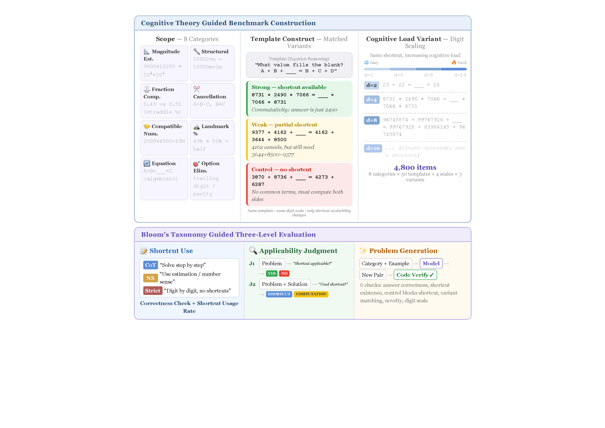
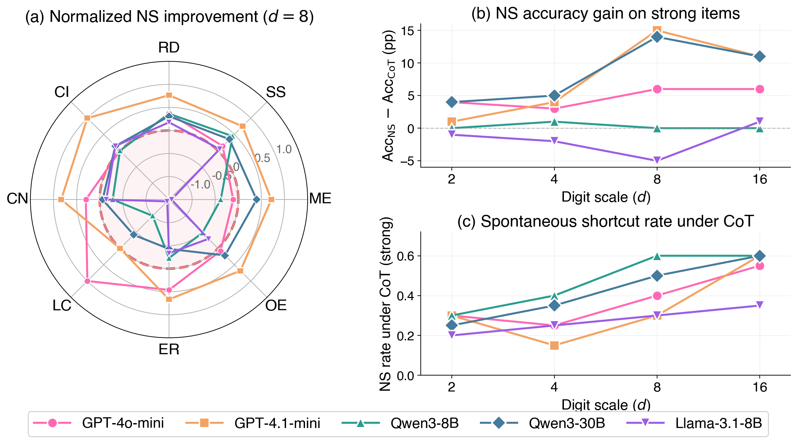

# SenseMath: When Number Sense Helps Numerical Reasoning in Large Language Models

<p align="center">
  <a href="https://arxiv.org/abs/2604.01988"></a>
  <a href="https://zhmzm.github.io/SenseMath/"></a>
  <a href="https://huggingface.co/datasets/DaydreamerMZM/SenseMath"></a>
  <a href="#license"></a>
</p>

<p align="center">
  
</p>

**SenseMath** is a controlled benchmark for measuring whether LLMs can exploit number-sense shortcuts — mental math strategies that significantly reduce computation — when prompted to do so.

<p align="center">
  
</p>

## Key Findings

- **NS prompting induces a broad shortcut-seeking mode**: accuracy on shortcut-amenable items is maintained or improved while control accuracy drops, reliably for GPT-4o-mini and Qwen3-8B
- **Number sense is multi-dimensional**: models show selective strengths and reversals across 8 shortcut categories
- **Three-level evaluation** (Use, Judge, Generate) reveals crossed dissociations in shortcut competence

## Benchmark

| Property | Value |
|----------|-------|
| Categories | 8 (Magnitude Est., Structural, Relative Dist., Cancellation, Compatible Num., Landmark, Equation, Option Elim.) |
| Digit scales | 4 (d=2, 4, 8, 16) |
| Families | 1,600 |
| Variants per family | 3 (strong, weak, control) |
| Prompting conditions | 3 (CoT, NS, Strict) |
| Total items | 4,800 |

### Shortcut Definition

A shortcut is **effective** if it reduces the problem to operations trivially executable mentally: single-digit arithmetic, multiplication by powers of 10, or simple addition/subtraction after simplification.

### Three-Tier Categories

| Tier | Categories | Shortcut Level |
|------|-----------|---------------|
| Problem-level | Magnitude Est., Structural, Relative Dist., Cancellation, Compatible Num., Landmark | Numerical structure of the problem |
| Reasoning-level | Equation Reasoning | Algebraic identity shortcuts |
| Option-level | Option Elimination | Structural features of answer choices |

## Quick Start

```bash
git clone https://github.com/zhmzm/SenseMath.git
cd SenseMath
```

### Load the Benchmark

```python
import json

with open("benchmark/sensemath_v2_d4.json") as f:
    families = json.load(f)

family = families[0]
print(family["category"])
print(family["strong_shortcut"]["pure_math"]["question"])
print(family["strong_shortcut"]["pure_math"]["options"])
```

### Run Inference

```bash
# GPU models via vLLM
python code/run_inference_vllm.py --model Qwen/Qwen3-8B --tp 4 --scale 4

# API models
export OPENAI_API_KEY="your-key"
python code/run_inference_api.py --step inference --model gpt-4o-mini --scale 4
```

### Three-Level Evaluation

```bash
# Judge tasks (J1: shortcut recognition, J2: strategy identification)
python code/run_judge_tasks.py --step inference --task j1 --api --api-model gpt-4.1-mini

# Generate tasks (G2: problem construction + 6-check verification)
python code/run_g2_generation.py --api --api-model gpt-4.1-mini
python code/verify_g2.py
```

## Results (d=4)

| Model | CoT Acc (S/C) | NS Acc (S/C) | NS Rate (CoT→NS) | 95% CI |
|-------|---------------|--------------|-------------------|--------|
| GPT-4o-mini | 78/65 | 84/63 | 27%→77% | [+.015, +.147] ✓ |
| GPT-4.1-mini | 88/76 | 96/83 | 20%→68% | [−.035, +.075] |
| Qwen3-30B | 68/56 | 73/56 | 39%→86% | [−.020, +.095] |
| Qwen3-8B | 74/65 | 72/53 | 37%→86% | [+.032, +.158] ✓ |
| Llama-3.1-8B | 66/58 | 59/55 | 31%→78% | [−.125, +.035] |


## Data Format

```json
{
  "family_id": "magnitude_estimation_000001",
  "category": "magnitude_estimation",
  "strong_shortcut": {
    "pure_math": {
      "question": "Which is the best estimate for 9900 × 9800?",
      "options": ["97019990", "97020020", "97020010", "97020000"],
      "answer": "97020000"
    },
    "shortcut_strength": 0.985,
    "ns_shortcut": "Round both to 10000 and multiply."
  },
  "weak_shortcut": { ... },
  "control": { ... }
}
```

## Project Structure

```
SenseMath/
├── benchmark/          # Cleaned benchmark dataset (4 scales + judge tasks)
├── code/               # Inference, evaluation, and figure generation scripts
├── paper/              # LaTeX source and figures
├── results/            # Output directory for experiments
└── assets/             # README figures
```

## Citation

```bibtex
@article{zhuang2025sensemath,
  title={SenseMath: When Number Sense Helps Numerical Reasoning in Large Language Models},
  author={Zhuang, Haomin and Wang, Xiangqi and Shen, Yili and Cheng, Ying and Zhang, Xiangliang},
  journal={arXiv preprint arXiv:2604.01988},
  year={2025}
}
```

## License

MIT License. See [LICENSE](LICENSE) for details.
